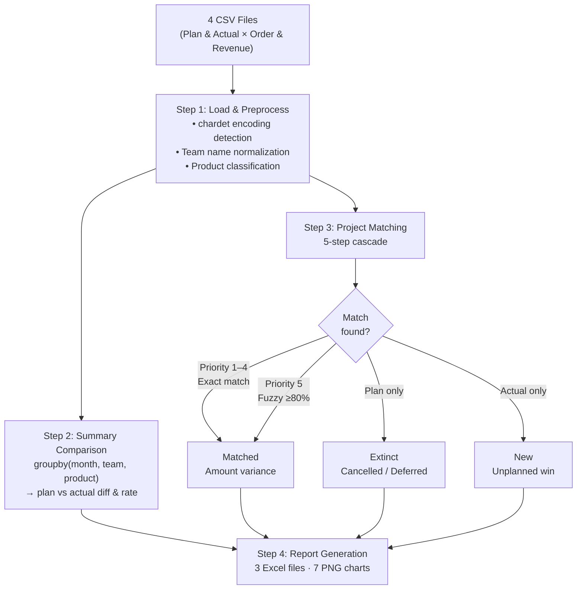

# Monthly Variance Analysis Pipeline
## Order & Revenue Reconciliation — Automated with Fuzzy Matching


> Built during an internship at **Iljin Electric Co., Ltd.** (Korea)  
> Q1 2026 · Heavy Electric Equipment Division — Power Transformers & Circuit Breakers

---

## Problem

Every month, the business planning team manually reconciled two sets of Excel exports to produce
a variance report comparing business-plan targets against actual order and revenue performance.
The process had three critical pain points:

| Pain Point | Impact |
|------------|--------|
| **Manual row-by-row comparison** across 4 separate files with 400–900 rows each | 4–6 hours per cycle; high error risk |
| **No project-level tracing** — only aggregate numbers were compared, leaving root causes opaque | Management could see *that* a gap existed, but not *why* |
| **Naming inconsistency** between planning and operations systems | The same project appeared under different names, PJT codes, or client spellings in different files, causing silent mismatches |

Without a systematic approach, a ₩30.0 billion order postponement (moved from Q1 to May) had
slipped through reconciliation undetected — only surfaced when totals were double-checked manually.

---

## Solution

An end-to-end Python pipeline that:

1. **Ingests** four CSV exports (plan vs. actual, order vs. revenue) with automatic encoding detection
2. **Normalizes** team names, product classifications, and date formats across inconsistent source formats
3. **Matches** every plan-side project to its actual-side counterpart using a 5-step cascade
4. **Classifies** each row as Matched / New / Extinct and quantifies the variance
5. **Generates** formatted Excel reports (3 files) and visualization charts (7 PNG) automatically

### 5-Step Project Matching Cascade

The core innovation is a priority-ordered matching strategy that mirrors how a human analyst
would verify project identity — starting with the most reliable signal and falling back gracefully:

```
Priority 1 → Exact project name match            (most reliable)
Priority 2 → PJT number match                    (system-assigned ID)
Priority 3 → Client (발주처) match within product group
Priority 4 → General contractor (원청) match
Priority 5 → Fuzzy name match via rapidfuzz      (≥ 80% token_sort_ratio)
```

The 80% fuzzy threshold was chosen empirically: it catches naming drift
(e.g., "Phase 1" vs "Ph.1", "TR" vs "Transformer") while avoiding false positives
between projects at different sites.

Unmatched plan-side rows → **Extinct** (cancelled or deferred)  
Unmatched actual-side rows → **New** (unplanned orders)

---

## Key Findings — Q1 2026

> *Figures based on internal data. Amounts expressed in ₩100 million (억 KRW).*

| Metric | Plan | Actual | Variance | Achievement |
|--------|-----:|-------:|---------:|------------:|
| **Total Orders** (중전기) | 2,607.5 | 4,290.1 | **+1,682.6** | **164.5%** |
| — Power Transformers | 2,231.4 | 3,875.0 | +1,643.6 | 173.7% |
| — Circuit Breakers | 376.2 | 415.0 | +38.8 | 110.3% |
| **Total Revenue** (중전기) | 1,140.5 | 1,214.3 | +73.8 | 106.5% |
| — Power Transformers | 906.7 | 974.2 | +67.5 | 107.4% |
| — Circuit Breakers | 233.8 | 240.1 | +6.3 | 102.7% |

**Project-level breakdown:**

| Category | Orders | Revenue |
|----------|-------:|--------:|
| Matched projects (plan ↔ actual) | 38 | 41 |
| Extinct (plan only — deferred/cancelled) | 11 | 7 |
| **New (actual only — unplanned wins)** | **68** | 52 |

The 164.5% order achievement was driven primarily by 68 unplanned project wins,
concentrated in international renewable energy (offshore wind, solar farms).

**Discrepancy reconciliation:**  
A ₩30.8 billion gap between the interim management report and the CSV-derived actual
was fully traced: one international project (₩30.0B) had been reclassified from
Q1 to May in the source system after the report was frozen, with minor adjustments
accounting for the remaining ₩0.8B.

---

## Pipeline Architecture

```
Input CSVs (4 files)
┌─────────────────────────────────────────────┐
│  Plan — Orders       Plan — Revenue         │
│  Actual — Orders     Actual — Revenue       │
└─────────────────┬───────────────────────────┘
                  │
                  ▼
         [분석.py — Main Pipeline]
                  │
    ┌─────────────┼──────────────┐
    ▼             ▼              ▼
Step 1          Step 2        Step 3
Load &        Summary       Project-level
Preprocess    Comparison    Matching
  │             │              │
  │           groupby       5-step cascade
  │           month ×       → Matched
  │           team ×        → New
  │           product       → Extinct
    └─────────────┴──────────────┘
                  │
                  ▼
         [Step 4 — Output Generation]
                  │
    ┌─────────────┼──────────────┐
    ▼             ▼              ▼
charts/      차이분析         Variance
(7 PNGs)     결과.xlsx        Text Report
             (7 sheets)
                  │
                  ▼
         [차이원인분析.py]  →  차이원인분析.xlsx
                  │
                  ▼
         [양식생성.py]      →  월별차이분析_1분기.xlsx
```



---

## Tech Stack

| Library | Version | Why chosen |
|---------|---------|------------|
| **pandas** | ≥1.5 | Vectorized groupby aggregation and outer-merge for plan/actual comparison — far faster than row-by-row Excel VBA loops |
| **numpy** | ≥1.23 | Efficient NaN handling and conditional achievement-rate calculation |
| **chardet** | ≥5.0 | Source files mixed EUC-KR and UTF-8-sig encodings; auto-detection eliminates manual per-file configuration |
| **rapidfuzz** | ≥3.0 | `token_sort_ratio` handles word-order differences in project names ("Phase 1 Alpha" vs "Alpha Phase 1"); significantly faster than pure-Python `difflib` |
| **matplotlib** | ≥3.6 | Waterfall chart, bar charts, donut charts — all generated programmatically with no manual Excel chart editing |
| **openpyxl** | ≥3.1 | Cell-level formatting (conditional fills, merged cells, borders) for publication-quality Excel output without a running Excel instance |

---

## Technical Challenges & Solutions

| Challenge | Root Cause | Solution |
|-----------|------------|----------|
| **Plan file has 9 garbage rows** at the top | Source system exports exchange-rate metadata before the data header | `skiprows=list(range(9)), header=0` — discovered by inspecting raw bytes |
| **Revenue actual file has 4 header rows** | Different export template from a separate module | `skiprows=list(range(4))` applied selectively to that file only |
| **Team name format mismatch** (`01.국내1` vs `국내1`) | Planning system prefixes team codes with numeric indices | `re.sub(r'^\d+\.', '', name)` normalization applied at load time |
| **Product classification inconsistency** | Plans use Korean labels (`변압기`), actuals use codes (`TR`, `HH`) | Single `classify_prod()` function maps both to canonical Korean labels |
| **Project name drift between systems** | No shared PJT ID enforced at data entry; project names evolve over time | 5-step cascade ending in `rapidfuzz.token_sort_ratio ≥ 80%` |
| **₩30.8B management-report vs CSV discrepancy** | One project reclassified to May after report freeze | Traced item-by-item using team-level breakdowns; documented in `보고기준_서식및매칭.py` |
| **DRM-protected source Excel** | Corporate DRM policy prevents programmatic write-back | Pipeline reads from CSV exports; prints manual-entry values when write-back fails |

---

## Getting Started

### Prerequisites

```bash
pip install -r requirements.txt
```

### Run with sample data (default)

```bash
# Step 1 — main analysis (SAMPLE_MODE = True by default)
python 분析.py

# Step 2 — drill-down cause analysis
python 차이원인분析.py

# Step 3 — monthly reporting template
python 양식생성.py
```

Output files appear in the project root and `charts/` folder.

### Switch to real data

1. Place your CSV files in `csv/`
2. Open `분析.py` and set `SAMPLE_MODE = False` (line ~35)
3. Confirm the four `FILE_*` variables match your actual filenames
4. Re-run the three scripts above

### Sample data structure

| File | Rows | Notes |
|------|-----:|-------|
| `csv/sample_사업계획_수주.csv` | 10 | 9 header rows then data (mirrors real format) |
| `csv/sample_실적_수주.csv` | 14 | Includes OUT-flagged rows to test filtering |
| `csv/sample_사업계획_매출.csv` | 12 | Standard CSV, no header skip |
| `csv/sample_실적_매출.csv` | 12 | 4 header rows then data (mirrors real format) |

The sample data includes matched projects, one extinct project (₩200B plan with no actual),
and three new projects (unplanned wins) to demonstrate all three classification outcomes.

---

## Output Files

### Excel (generated in project root)

| File | Sheets | Contents |
|------|-------:|---------|
| `차이分析_결과.xlsx` | 7 | Summary comparison, project deep-dive, new/extinct list, text reasons, visualization dashboard |
| `차이원인分析.xlsx` | 3 | Waterfall summary, order detail (extinct/new/changed), revenue detail |
| `월별차이分析_1분기.xlsx` | 1 | Monthly reporting template — Q1 filled, Apr–Jul blank for ongoing use |

### Charts (generated in `charts/`)

| File | Type | Shows |
|------|------|-------|
| `수주_월별.png` | Grouped bar | Order plan vs actual by month, split by product |
| `매출_월별.png` | Grouped bar | Revenue plan vs actual by month, split by product |
| `수주_워터폴.png` | Waterfall | Plan → New → Extinct → Changed → Actual flow |
| `수주_top10.png` | Horizontal bar | Top 10 projects by absolute order variance |
| `매출_top10.png` | Horizontal bar | Top 10 projects by absolute revenue variance |
| `수주_팀달성률.png` | Donut ×4 | Team-level order achievement rate |
| `매출_팀달성률.png` | Donut ×4 | Team-level revenue achievement rate |

---

## Limitations & Roadmap

**Current limitations**

- The pipeline covers Q1 2026 only; the `월별차이分析_1분기.xlsx` template has column
  structure prepared for Apr–Jul but those cells are empty pending data.
- The ₩27.5B revenue actual discrepancy is attributed to an exchange-rate application
  difference (USD 1,400 vs 1,300) but is not yet fully confirmed with source data.
- `보고기준_서식및매칭.py` contains hardcoded team-level subtotals that must be
  updated manually each reporting cycle.

**Roadmap**

- [ ] Parameterize reporting period (currently hardcoded as Q1)  
- [ ] Add unit tests for the matching cascade with edge-case project names  
- [ ] Replace hardcoded subtotals with dynamic aggregation from CSV  
- [ ] Extend to half-year and full-year templates  
- [ ] Add a CLI entry point (`python run.py --quarter Q2 --mode sample`)

---

## Repository Structure

```
.
├── 분析.py                     # Main pipeline (entry point)
├── 차이원인분析.py               # Cause classification & detail Excel
├── 양식생성.py                  # Monthly reporting template generator
├── 보고기준_서식및매칭.py         # Management-report vs CSV reconciliation
├── 수치흐름.py                  # Numeric flow verification sheet
├── requirements.txt
├── LICENSE
│
└── csv/
    ├── sample_사업계획_수주.csv   # Sample: order plan
    ├── sample_실적_수주.csv       # Sample: order actual
    ├── sample_사업계획_매출.csv   # Sample: revenue plan
    └── sample_실적_매출.csv       # Sample: revenue actual
```

---

## License

MIT — see [LICENSE](LICENSE)

---

*Built to replace a manual Excel reconciliation process that consumed 4–6 hours per reporting
cycle. Feedback and contributions are welcome.*
